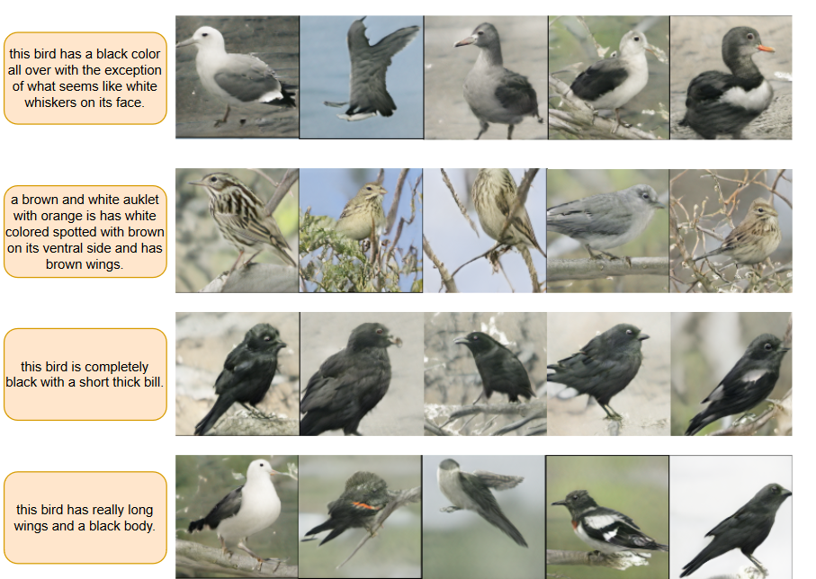

# Regularized Conditional Generative Adversarial Networks for Image Synthesis

Pytorch implementation for our RCGAN. We propose a simple yet effective way to address mode collapse issue. It can be applied to any conditional Generative Adversarial Network on any task to improve the diversity.<br>
**Note:** We built our work upon [MSGAN](https://github.com/HelenMao/MSGAN) and [StackGAN++](https://github.com/hanzhanggit/StackGAN-v2). Please consider checking them out. <br>
Contact: Alper Karadag (alper.karadag@ug.bilkent.edu.tr), Halil Ibrahim Kuru (ibrahim.kuru@bilkent.edu.tr), and Samet Ozcan (samet.ozcan@ug.bilkent.edu.tr) 

## Example Results


## Usage

### Prerequisites
- Python 3.5 or Python 3.6
- Pytorch 0.4.0 and torchvision (https://pytorch.org/)

### Install
- Clone this repo:
```
git clone https://github.com/alperkaradag/RCGAN.git
```
## Training
Download datasets into the dataset folder
```
mkdir datasets
```
- Dataset: CUB-200-2011
- Baseline: StackGAN++ <br>

You can download the datasets from the StackGAN++ [[Github Project]](https://github.com/hanzhanggit/StackGAN-v2).
```
cd MSGAN/StackGAN++-Mode-Seeking
python main.py --cfg cfg/birds_3stages.yml
```
## Pre-trained Models
- [StackGAN++-Mode-Seeking](https://drive.google.com/open?id=1tnDDolN-OMLG4BUNB6rPIjSXoP2FbXgw)
- [Inception V3](https://download.pytorch.org/models/inception_v3_google-1a9a5a14.pth)
- [Inception V3 for FID calculation](http://download.tensorflow.org/models/image/imagenet/inception-2015-12-05.tgz) for more information about FID calculation check out [[Github Page]](https://github.com/mseitzer/pytorch-fid)

Download and save into 
```
./models/
```

## Evaluation
For [StackGAN++](https://github.com/hanzhanggit/StackGAN-v2) please follow the instructions of corresponding github projects of the baseline frameworks for more evaluation details. <br>
### Testing Examples
**StackGAN++-Mode-Seeking** <br>
```
python main.py --cfg cfg/eval_birds.yml --filter=True
```

## Reference
- MSGAN [[Github Project]](https://github.com/HelenMao/MSGAN)
- StackGAN++ [[Github Project]](https://github.com/hanzhanggit/StackGAN-v2)
- FID [[Github Project]](https://github.com/mseitzer/pytorch-fid)

